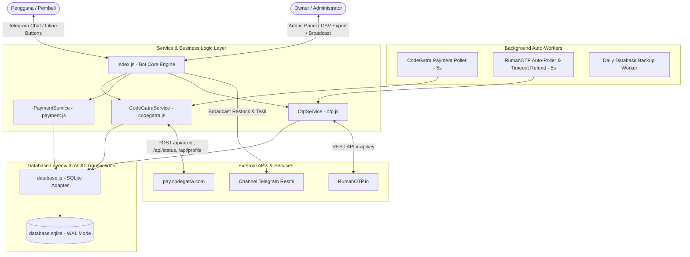
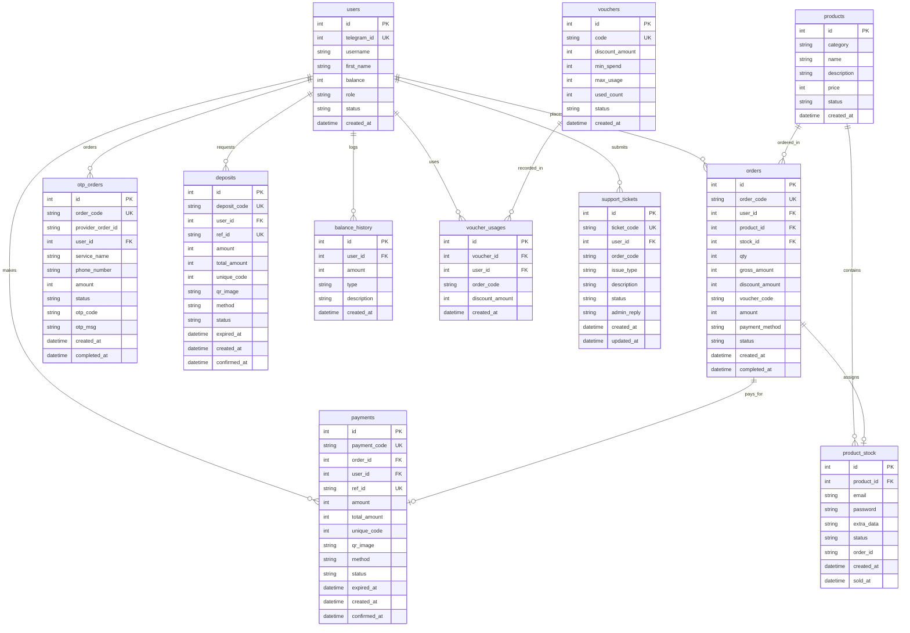

# 📚 DOKUMENTASI ARSITEKTUR & PEMBARUAN SISTEM
## JStore Digital Bot (v1.3.0 → v2.0.0 Enterprise Edition)
*Digital Premium Store & Virtual SMS OTP Telegram Bot with 100% CodeGatra Auto QRIS*

---

## 📑 DAFTAR ISI
1. [Ringkasan Proyek](#1-ringkasan-proyek)
2. [Arsitektur Sistem Terperinci](#2-arsitektur-sistem-terperinci)
3. [Skema & Relasi Basis Data (ERD)](#3-skema--relasi-basis-data-erd)
4. [Integrasi Payment Gateway Auto QRIS CodeGatra](#4-integrasi-payment-gateway-auto-qris-codegatra)
5. [Sistem Virtual SMS OTP & Auto-Refund Engine](#5-sistem-virtual-sms-otp--auto-refund-engine)
6. [Fitur-Fitur Baru & Pembaruan Sistem](#6-fitur-fitur-baru--pembaruan-sistem)
7. [Fitur Admin & Kontrol Toko](#7-fitur-admin--kontrol-toko)
8. [Struktur File & Modul Kode](#8-struktur-file--modul-kode)
9. [Panduan Konfigurasi (.env)](#9-panduan-konfigurasi-env)
10. [Cara Menjalankan & Deployment](#10-cara-menjalankan--deployment)
11. [Panduan Pengujian & Troubleshooting](#11-panduan-pengujian--troubleshooting)

---

## 1. RINGKASAN PROYEK

**JStore Digital Bot** adalah bot Telegram e-commerce hibrida yang dirancang untuk menjual:
1. **Akun & Lisensi Produk Digital**: Canva Pro, Spotify Premium, Netflix, ChatGPT Plus, CapCut Pro, dan produk digital lainnya dengan pemenuhan stok instan.
2. **Nomor Virtual SMS OTP**: Penyediaan nomor telepon virtual dari berbagai negara untuk verifikasi SMS aplikasi (WhatsApp, Telegram, Google, TikTok, dll) yang terintegrasi dengan RumahOTP API.
3. **Sistem Pembayaran 100% Auto QRIS 24 Jam**: Pembuatan QRIS dinamis dengan nominal unik dan pelacakan pembayaran otomatis via CodeGatra Gateway (`pay.codegatra.com`). Seluruh metode manual dan bukti transfer foto telah dihapus secara total demi kecepatan dan otomatisasi penuh.

| Parameter | Keterangan |
| :--- | :--- |
| **Runtime** | Node.js (v20+ / v22+ / v26+) |
| **Telegram Framework** | `node-telegram-bot-api` |
| **Database Engine** | SQLite3 (Mendukung `node:sqlite` bawaan Node.js & library `sqlite3`) |
| **Payment Gateway** | 100% CodeGatra Auto QRIS API (`pay.codegatra.com`) |
| **OTP Gateway** | RumahOTP REST API (`rumahotp.io`) |
| **Graphic Renderer** | Canvas API / Fallback Smart Banner untuk Struk dan Notifikasi Restock |

---

## 2. ARSITEKTUR SISTEM TERPERINCI

Sistem mengadopsi arsitektur **Event-Driven Modular Monolith** dengan pemrosesan background worker mandiri untuk memastikan ketersediaan transaksi 24 jam nonstop tanpa ketergantungan verifikasi manual admin.



### Alur Kerja Transaksi:
1. **Pembelian Produk Digital via Saldo**:
   - Pembeli memilih produk dan jumlah.
   - Sistem memverifikasi saldo dan voucher (jika ada).
   - Eksekusi transaksi atomik SQLite: pemotongan saldo, pengambilan stok akun (`status = 'available' -> 'sold'`), pencatatan pesanan `completed`.
   - Kredensial akun (email, password, extra data) langsung dikirimkan ke chat pembeli.
2. **Pembelian Produk Digital via Auto QRIS (CodeGatra Exclusive)**:
   - Sistem membuat order QRIS dinamis via CodeGatra dengan nominal unik (contoh: Rp 35.142).
   - Menampilkan gambar QRIS dan countdown batas waktu pembayaran (10 menit).
   - Poller latar belakang mendeteksi status `paid` dalam 5 detik.
   - Akun langsung otomatis dikirim ke chat pembeli saat itu juga tanpa perlu konfirmasi admin.
3. **Pemesanan Nomor Virtual SMS OTP**:
   - Pembeli memilih layanan dan negara.
   - Saldo dipotong dan bot memesan nomor ke RumahOTP API.
   - Poller latar belakang memantau status pesanan setiap 5 detik.
   - Begitu SMS OTP diterima, bot langsung mengirimkan kode OTP (`<code>123456</code>`) ke pembeli.
   - Jika dalam 15 menit SMS tidak masuk, sistem secara otomatis membatalkan pesanan ke provider dan me-refund 100% saldo ke akun pembeli.

---

## 3. SKEMA & RELASI BASIS DATA (ERD)

Database SQLite diatur dengan mode **WAL (Write-Ahead Logging)** dan foreign keys aktif untuk integritas data tinggi.



---

## 4. INTEGRASI PAYMENT GATEWAY AUTO QRIS CODEGATRA

Integrasi mengacu pada spesifikasi resmi API CodeGatra (`https://pay.codegatra.com/api`).

### Endpoint yang Diimplementasikan:
1. **Validasi Profil & API Key (`POST /api/profile`)**:
   - Header: `Authorization: Bearer <API_KEY>`
   - Memverifikasi keaktifan merchant dan nama project.
2. **Pembuatan Transaksi QRIS Dinamis (`POST /api/order`)**:
   - Header: `Authorization: Bearer <API_KEY>`
   - Payload:
     ```json
     {
       "nama_project": "jstore",
       "ref_id": "ORD-1725180000-123",
       "amount": 35000,
       "customer_name": "Username",
       "expired": 10
     }
     ```
   - Respon: Menghasilkan `qr_image`, `unique_code`, dan `total_amount` (contoh: Rp 35.127).
3. **Pengecekan Status Transaksi (`POST /api/status`)**:
   - Header: `Authorization: Bearer <API_KEY>`
   - Payload: `{ "ref_id": "ORD-1725180000-123" }`
   - Respon: `payment_status` (`paid`, `pending`, `expired`, `cancelled`).

### Background Poller Daemon:
- Worker `CodeGatraService.startAutoPollingPaymentWorker` berjalan setiap **5 detik**.
- Memeriksa tabel `payments` dan `deposits` yang berstatus `pending`.
- Ketika status berubah menjadi `paid`:
  - **Deposit**: Saldo pengguna ditambahkan secara atomik dan mengirim notifikasi sukses.
  - **Order Akun**: Mengalokasikan stok akun digital, menandai order `completed`, dan mengirim email + password ke pembeli.
- Mengirimkan salinan struk transaksi sukses ke Channel Telegram jika dikonfigurasi.

---

## 5. SISTEM VIRTUAL SMS OTP & AUTO-REFUND ENGINE

1. **Integrasi RumahOTP REST API**:
   - Mengambil katalog aplikasi (`/api/v2/services`), negara (`/api/v2/countries`), dan operator (`/api/v2/operators`).
   - Melakukan order nomor (`/api/v2/orders`) dengan margin keuntungan otomatis yang diatur di `.env` (`OTP_PROFIT_MARGIN`).
2. **Auto-Polling Penerimaan SMS**:
   - Worker `OtpService.startAutoPollingOtpWorker` berjalan setiap **5 detik**.
   - Begitu SMS OTP diterima oleh provider, bot langsung mengirimkan kode OTP ke chat pengguna secara real-time.
3. **Auto-Timeout & Auto-Refund**:
   - Jika dalam **15 menit** SMS tidak kunjung masuk, sistem secara otomatis membatalkan pesanan ke provider dan mengembalikan saldo 100% ke akun pembeli secara otomatis.

---

## 6. FITUR-FITUR BARU & PEMBARUAN SISTEM

| Modul / Fitur | Deskripsi |
| :--- | :--- |
| ⚡ **100% Auto QRIS CodeGatra** | Pembayaran deposit & beli produk otomatis 24 jam tanpa admin & tanpa upload foto struk. |
| 🛡️ **ACID Database Transactions** | Mencegah *double selling* / *race condition* saat stok produk diperebutkan banyak user. |
| 🎟️ **Sistem Voucher Promo** | Pembeli dapat memasukkan kode voucher promo saat checkout untuk potongan harga. |
| 📜 **Riwayat Transaksi Pengguna** | Menu `/riwayat` untuk melihat akun yang pernah dibeli dan riwayat kode OTP. |
| 🔍 **Pencarian Cepat Produk** | Menu `/cari <keyword>` untuk mencari variasi produk tanpa scroll pagination. |
| 🛡️ **Klaim Garansi & Support** | Menu `/garansi` untuk membuat tiket pengaduan akun bermasalah ke admin. |
| 📊 **Export Laporan Penjualan CSV** | Admin dapat mengekspor seluruh transaksi ke file `.csv` langsung dari bot. |
| ⚙️ **Status & Profil CodeGatra** | Admin dapat mengecek status koneksi payment gateway dari menu admin. |
| 📢 **Broadcast Rate-Limited** | Pengiriman siaran aman dengan delay 35ms antar user untuk mencegah banned Telegram 429. |
| 🔒 **Isolasi Kredensial (.env)** | Seluruh API key, token, dan ID owner tersimpan aman di `.env`. |

---

## 7. FITUR ADMIN & KONTROL TOKO

Akses panel admin melalui perintah `/admin`.

1. **Kelola Produk & Variasi**: Tambah produk, ubah harga jual, aktifkan/nonaktifkan produk, atau hapus produk.
2. **Input Stok & Import File `.txt`**: Tambah stok akun satuan atau upload file `.txt` berisi ribuan akun dengan auto-deduplication dan auto-broadcast banner restock.
3. **Kelola Voucher Diskon**: Buat kode promo dengan potongan nominal dan minimal transaksi.
4. **Statistik & Export CSV**: Unduh file laporan penjualan `.csv` kapan saja.
5. **Cek Koneksi & Saldo Gateway**: Pantau status CodeGatra dan saldo akun provider RumahOTP.
6. **Edit Saldo User**: Ubah saldo pengguna langsung dari chat Telegram.
7. **Broadcast Pesan/Foto**: Kirim siaran massal aman dengan rate-limiter 35ms.
8. **Backup Database**: Unduh backup database `.zip` secara langsung via `/backup`.

---

## 8. STRUKTUR FILE & MODUL KODE

```
1Auto-order-app/
├── .env                  # Konfigurasi environment & secret keys
├── .env.example          # Contoh template konfigurasi
├── config.js             # Loader konfigurasi dengan fallback
├── database.js           # SQLite adapter, skema DB, & engine transaksi ACID
├── codegatra.js          # Client API CodeGatra & background payment poller
├── otp.js                # Client API RumahOTP, background poller, & card generator
├── payment.js            # Service pembayaran, validasi voucher, & deposit (100% Auto)
├── index.js              # Bot core engine, message router, & UI handlers
├── package.json          # Metadata dependensi & start script
├── database/
│   └── database.sqlite   # Basis data SQLite utama
└── backups/              # Direktori penyimpanan file backup zip & export CSV
```

---

## 9. PANDUAN KONFIGURASI (.ENV)

Buka atau buat file `.env` pada direktori utama bot:

```env
# ================================================================
# JSTORE DIGITAL BOT - ENVIRONMENT CONFIGURATION
# ================================================================

# Telegram Bot Credentials
BOT_TOKEN=8611384867:AAE-IYs-BCKoObwswnjz39lXSRUZ0QfQLfg
OWNER_ID=8915677989
ADMIN_IDS=8915677989

# Store Identity
STORE_NAME=Jepirez DIGITAL
STORE_USERNAME=Jepzstore_bot
CHANNEL_ID=-1004335640519
CHANNEL_URL=https://t.me/testijepz
GROUP_URL=https://t.me/jpzplay
SUPPORT_USERNAME=lipkill
BANNER_URL=https://files.catbox.moe/rvpfk8.jpg

# CodeGatra Auto QRIS Payment Gateway
CODEGATRA_BASE_URL=https://pay.codegatra.com/api
CODEGATRA_API_KEY=mk_xxxxxxxxxxxxxxxxxxxxxxxxxxxxxxxx
CODEGATRA_NAMA_PROJECT=nama_project_merchant_anda
CODEGATRA_EXPIRED_MINUTES=10

# RumahOTP Virtual SMS Service
RUMAHOTP_API_KEY=rk-dev-4t0UxAzXvQQRXr4VIixWXUQ1AL0qU4P6
RUMAHOTP_BASE_URL=https://www.rumahotp.io
OTP_PROFIT_MARGIN=1500

# Pengaturan Umum
CURRENCY=Rp
MIN_DEPOSIT=10000
ITEMS_PER_PAGE=5
AUTO_BACKUP_HOURS=24
```

---

## 10. CARA MENJALANKAN & DEPLOYMENT

### A. Prasyarat Sistem
- Node.js versi 18 ke atas (Direkomendasikan Node.js v20 LTS atau v22).
- Akses internet untuk polling Telegram dan API eksternal.

### B. Deployment Menggunakan Dokploy (PaaS / Docker)

Bot ini telah dilengkapi konfigurasi `Dockerfile` dan `docker-compose.yml` yang teroptimasi untuk **Dokploy**:

#### Cara Deploy di Dokploy:
1. **Buat Application Baru di Dashboard Dokploy**:
   - Pilih **Application** → **Create Application**.
   - Pilih Source: **Git** (Hubungkan repository GitHub/GitLab bot Anda).
2. **Pilih Build Type**:
   - Pilih **Dockerfile** (otomatis mendeteksi `Dockerfile` di root proyek) atau pilih **Docker Compose**.
3. **Konfigurasi Environment Variables di Dokploy**:
   - Buka tab **Environment** di aplikasi Dokploy Anda.
   - Masukkan variabel dari file `.env` (terutama `BOT_TOKEN`, `OWNER_ID`, `CODEGATRA_API_KEY`, `CODEGATRA_NAMA_PROJECT`, `RUMAHOTP_API_KEY`).
4. **Konfigurasi Persistent Volumes (PENTING)**:
   - Buka tab **Volumes / Storage** di Dokploy:
     - **Mount Path 1**: `/app/database` → Host Path: `/etc/dokploy/volumes/jstore-data`
     - **Mount Path 2**: `/app/backups` → Host Path: `/etc/dokploy/volumes/jstore-backups`
   - *Tujuan:* Memastikan data user, stok akun, dan transaksi SQLite tetap tersimpan aman saat bot di-restart atau di-update!
5. **Deploy**:
   - Klik tombol **Deploy**. Dokploy akan meng-compile container Debian Bookworm dengan dependensi Canvas C++ dan menjalankan bot 24 jam nonstop!

---

### C. Deployment Standalone / Manual (Node.js & PM2)

1. **Install Dependensi**:
   ```bash
   npm install --ignore-scripts
   ```

2. **Atur Kredensial di `.env`**:
   Pastikan `BOT_TOKEN`, `CODEGATRA_API_KEY`, dan `CODEGATRA_NAMA_PROJECT` sudah terisi.

3. **Jalankan Bot**:
   ```bash
   node index.js
   ```
   Atau menggunakan PM2 untuk proses latar belakang:
   ```bash
   npm install -g pm2
   pm2 start index.js --name "jstore-bot"
   pm2 save
   ```

---

## 11. PANDUAN PENGUJIAN & TROUBLESHOOTING

### Perintah Cepat Pengujian:
- `/start` : Membuka dashboard utama bot.
- `/katalog` : Menampilkan katalog produk berkategori.
- `/saldo` : Mengecek saldo akun.
- `/deposit` : Menguji pembuatan invoice QRIS otomatis CodeGatra.
- `/riwayat` : Mengecek riwayat pesanan dan akun yang dibeli.
- `/cari <nama>` : Menguji fitur pencarian produk.
- `/admin` : Membuka panel kontrol owner/admin.
- `/export` : Mengunduh rekap transaksi dalam format file `.csv`.
- `/backup` : Membuat file zip cadangan database SQLite saat ini.

### Troubleshooting:
- **QRIS CodeGatra tidak muncul**: Periksa apakah `CODEGATRA_API_KEY` dan `CODEGATRA_NAMA_PROJECT` di file `.env` sudah sesuai dengan data di dashboard `pay.codegatra.com`.
- **SMS OTP lambat**: Beberapa operator negara membutuhkan waktu 1–3 menit untuk menerima SMS. Bot akan otomatis mengirimkan kode ke chat begitu SMS masuk tanpa perlu merefresh secara manual.
